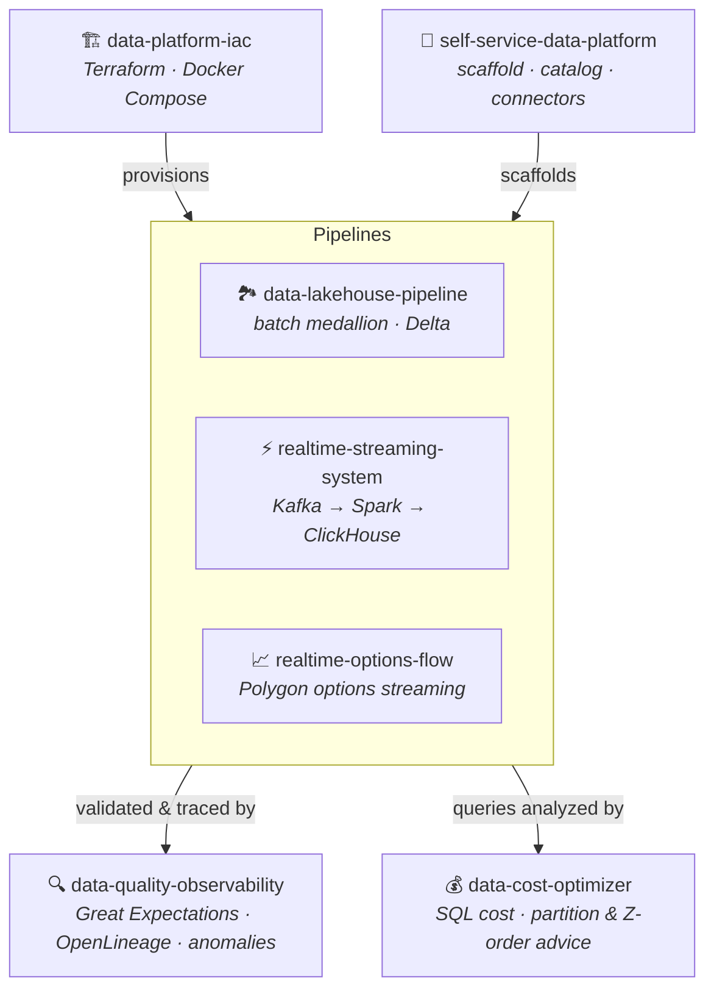

<h1 align="center">Venu Kurella</h1>

  <b>Senior / Staff / Principal Data Engineer &nbsp;·&nbsp; Data Platform Architect</b> 
  Financial services &amp; capital markets · 21 years building enterprise data platforms

  <a href="https://www.linkedin.com/in/venu-gopal-kurella-79094617/">LinkedIn</a> ·
  <a href="mailto:venugkurella@gmail.com">venugkurella@gmail.com</a> ·
  <a href="#experience">Experience</a> ·
  <a href="#modern-data-platform-portfolio">Portfolio</a> ·
  <a href="#lets-talk">Contact</a>

---

## About me

I'm a data platform architect with **21 years** designing, building, and governing
enterprise-scale data platforms for global financial institutions. I build **reliable batch
and streaming data platforms** — and the data-quality, observability, infrastructure, and
self-service tooling around them. My day job is enterprise financial data (currently
**Bloomberg**; previously **Credit Suisse, Wells Fargo, HPE, Cox Automotive, Franklin
Templeton**), where correctness, lineage, validation, and regulatory confidence are the whole game.

I operate at the **staff/principal** level: I set data-engineering standards, own architecture
across teams, and stay hands-on in the codebase. Over my career I've led teams of up to **13
engineers**, delivered multi-year data-modernization programs, and worked across regulated data
domains — trades, sensitivities, positions, collateral, counterparty, securities, and regulatory
reporting.

The through-line in my work: I don't just ship one-off pipelines. I build **reliable data
products, reusable engineering patterns, and platform capabilities** that make other teams faster
while improving trust, governance, and operating discipline.

**What I bring**

- 🏛️ **Regulated financial data** — Dodd-Frank / FDIC, credit risk, MDM, reconciliation, auditability
- 🔧 **Hands-on platform engineering** — Spark, Kafka, Airflow, Snowflake, Delta Lake, Terraform
- 🔍 **Data quality & observability** — Great Expectations, OpenLineage, anomaly detection, SLA monitoring
- 🧭 **Architecture & influence** — standards-setting, architecture reviews, mentoring, stakeholder alignment

## 🎯 Open to

**Staff / Principal / Senior Data Engineer**, **Data Platform Architect**, and **Data Quality / Platform Lead**
roles — remote or NJ/NYC metro. Happy to talk data platforms, streaming, data quality, or financial-data
systems. Reach me at **venugkurella@gmail.com**.

## Modern Data Platform Portfolio

Beyond my professional work, I maintain a public, CI-verified portfolio. These seven repositories
fit together as one platform rather than seven disconnected demos: infrastructure provisions the
runtime, a self-service layer generates pipelines, batch and streaming pipelines move the data, a
quality/observability layer watches them, and a cost optimizer keeps the warehouse honest. Every
project runs end-to-end and is **verified in CI** — not slideware.

| Project | What it demonstrates | Stack | CI |
|---|---|---|---|
| **[data-lakehouse-pipeline](https://github.com/vnugny/data-lakehouse-pipeline)** | End-to-end batch medallion (bronze→silver→gold) with idempotent transforms and gold↔silver reconciliation, run for real in CI | Airflow · PySpark · Delta Lake · dbt · Trino |  |
| **[realtime-streaming-system](https://github.com/vnugny/realtime-streaming-system)** | Event-time streaming with windowing, watermarks, anomaly detection, and a full containerized path proven end-to-end in CI | Kafka · Spark Structured Streaming · ClickHouse · Grafana |  |
| **[realtime-options-flow](https://github.com/vnugny/realtime-options-flow)** | The streaming architecture applied to **real options trades** — per-underlying flow, block/skew anomalies; dual live-Polygon/synthetic source | Kafka · Spark · ClickHouse · Grafana · Polygon WS |  |
| **[data-quality-observability](https://github.com/vnugny/data-quality-observability)** | Validation, column-level lineage, statistical anomaly detection, and SLA alerting layered onto the lakehouse | Great Expectations · OpenLineage · Elementary · Slack |  |
| **[self-service-data-platform](https://github.com/vnugny/self-service-data-platform)** | Platform tooling other engineers consume: Jinja pipeline scaffolding, a Delta catalog + scanner, reusable connectors | Click CLI · FastAPI · Jinja2 · Delta |  |
| **[data-platform-iac](https://github.com/vnugny/data-platform-iac)** | Platform ownership beyond pipeline code: AWS Terraform modules (MSK/RDS/Redshift/S3) + a one-command local stack | Terraform · Docker Compose · AWS · MinIO |  |
| **[data-cost-optimizer](https://github.com/vnugny/data-cost-optimizer)** | FinOps for the warehouse: sqlglot anti-pattern analysis, cross-engine cost estimates, partition/Z-order advice, benchmarks | sqlglot · DuckDB · Spark · Streamlit |  |

> Every repository builds and tests on GitHub Actions on each push. Together the portfolio is
> roughly **190 tests** across batch, streaming, quality, platform, and cost tooling.

<h2 id="experience">Experience</h2>

| Role | Organization | When |
|---|---|---|
| Senior Engineer (→ from Consultant) | **Bloomberg L.P.** — Skillman, NJ | Nov 2022 – Present |
| Snowflake Architect Consultant | **Cox Automotive** (via SLIQ) | Dec 2021 – Oct 2022 |
| Snowflake Architect Consultant | **Hewlett Packard Enterprise** (via SLIQ) | Dec 2020 – Dec 2021 |
| Senior Data Engineer Consultant | **Wells Fargo Bank** (via SLIQ) | Sep 2018 – Dec 2020 |
| Big Data Consultant | **PVH Corp** (Calvin Klein, Tommy Hilfiger) | May 2018 – Sep 2018 |
| Assistant Vice President | **Credit Suisse** — Bangalore, India | Jun 2013 – Apr 2018 |
| Software Consultant *(Credit Suisse engagement)* | **Comtel Technologies** — Singapore | Jun 2010 – Jun 2013 |
| Software Analyst — Enterprise Data Warehouse | **Franklin Templeton Investments** — Hyderabad | Nov 2006 – Jun 2010 |
| Senior Software Engineer *(Merck & Co. offshore)* | **Lionbridge Technologies** — Chennai | May 2005 – Oct 2006 |

**Selected highlights**

- **Bloomberg** — architected an enterprise data-validation platform (Great Expectations across PostgreSQL, Snowflake, Kafka, S3) that **cut data incidents ~60%** and held **>95% validation pass rates** on critical financial datasets; consolidated legacy contracts into Snowflake, cutting ETL time 15%.
- **Wells Fargo** — owned ETL architecture across **9 regulated financial data domains** (trades, sensitivities, positions, collateral, counterparty…) for a Dodd-Frank / FDIC program; defined the modeling and data-quality patterns delivery teams built to.
- **Credit Suisse** — MDM &amp; data-quality lead for a global credit-risk platform ingesting **3M+ trades/day from 300+ feeds**, running a **13-engineer** team and the reference-data governance model.
- **Cox Automotive / HPE** — architected multi-zone Snowflake platforms at petabyte scale; delivered 16 partner-experience IT projects at HPE.

## Technical skills

**Data platforms** Snowflake · Redshift · Delta Lake / lakehouse · ClickHouse · Trino · PostgreSQL · Oracle · Teradata
**Processing & orchestration** Apache Spark / PySpark · Spark Structured Streaming · Kafka · dbt · Airflow
**Quality & governance** Great Expectations · OpenLineage · Informatica IDQ/MDM · lineage · anomaly detection · SLA monitoring · reconciliation
**Platform & infra** Terraform · Docker / Compose · AWS (S3, MSK, EMR, Glue, Redshift) · FastAPI · Click · GitHub Actions / CI-CD
**Languages** Python · SQL · PL/SQL · Shell
**Domains** Capital markets · credit risk · regulatory reporting (Dodd-Frank/FDIC) · trades / positions / collateral / counterparty / reference data

## Education

- **M.S. Computer Science** — Hyderabad, India (2001–2003)
- **B.S. Computer Science** (Mathematics, Statistics) — Hyderabad, India (1998–2000)

<h2 id="lets-talk">Let's talk</h2>

I'm always glad to talk data platforms, streaming, data quality, or financial-data systems.

- 📧 **venugkurella@gmail.com**
- 💼 **[LinkedIn](https://www.linkedin.com/in/venu-gopal-kurella-79094617/)**
- 💻 **[github.com/vnugny](https://github.com/vnugny)**

Detailed resume available on request.
