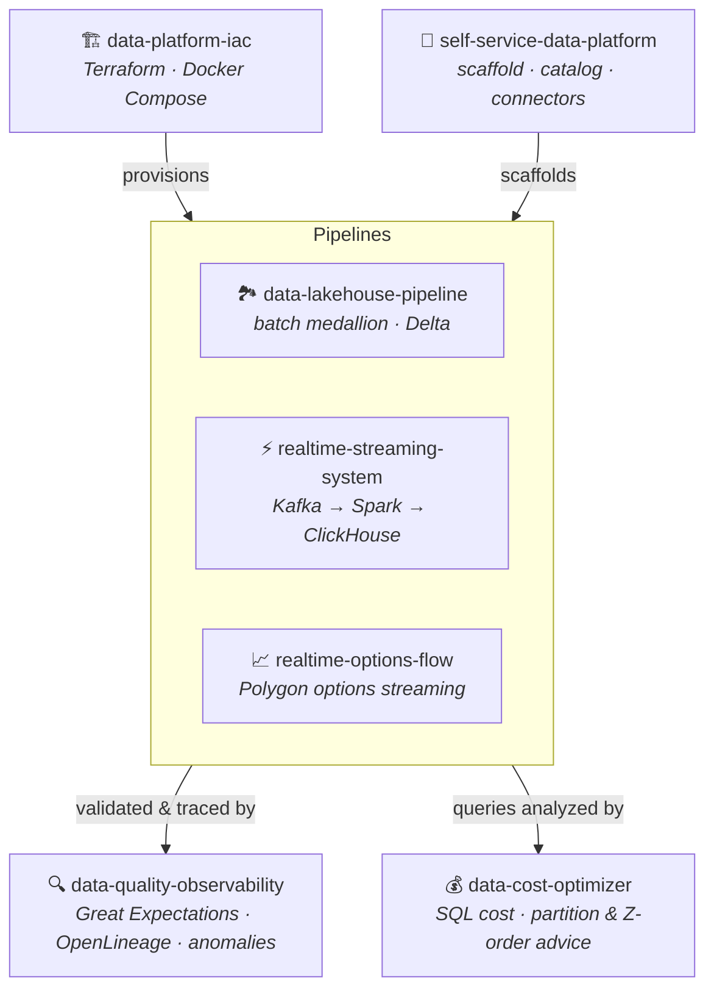

<h1 align="center">Venu Kurella</h1>

  <b>Senior / Staff / Principal Data Engineer &nbsp;·&nbsp; Data Platform Architect</b> 
  Financial services &amp; capital markets · 21 years building enterprise data platforms

  <a href="https://www.linkedin.com/in/venu-gopal-kurella-79094617/">LinkedIn</a> ·
  <a href="mailto:venugkurella@gmail.com">venugkurella@gmail.com</a>

---

I build **reliable batch and streaming data platforms** — and the quality, observability,
infrastructure, and self-service tooling around them. My day job is enterprise financial
data (currently Bloomberg; previously Credit Suisse, Wells Fargo, HPE, Cox Automotive,
Franklin Templeton), where correctness, lineage, validation, and regulatory confidence
are the whole game.

The repositories below are a **working portfolio** of that same discipline in a modern
open-source stack. Every project runs end-to-end and is **verified in CI** — not slideware.

## Modern Data Platform Portfolio

These seven repositories fit together as one platform rather than seven disconnected demos:
infrastructure provisions the runtime, a self-service layer generates pipelines, batch and
streaming pipelines move the data, a quality/observability layer watches them, and a cost
optimizer keeps the warehouse honest.

| Project | What it demonstrates | Stack | CI |
|---|---|---|---|
| **[data-lakehouse-pipeline](https://github.com/vnugny/data-lakehouse-pipeline)** | End-to-end batch medallion (bronze→silver→gold) with idempotent transforms and gold↔silver reconciliation, run for real in CI | Airflow · PySpark · Delta Lake · dbt · Trino |  |
| **[realtime-streaming-system](https://github.com/vnugny/realtime-streaming-system)** | Event-time streaming with windowing, watermarks, anomaly detection, and a full containerized path proven end-to-end in CI | Kafka · Spark Structured Streaming · ClickHouse · Grafana |  |
| **[realtime-options-flow](https://github.com/vnugny/realtime-options-flow)** | The streaming architecture applied to **real options trades** — per-underlying flow, block/skew anomalies; dual live-Polygon/synthetic source | Kafka · Spark · ClickHouse · Grafana · Polygon WS |  |
| **[data-quality-observability](https://github.com/vnugny/data-quality-observability)** | Validation, column-level lineage, statistical anomaly detection, and SLA alerting layered onto the lakehouse | Great Expectations · OpenLineage · Elementary · Slack |  |
| **[self-service-data-platform](https://github.com/vnugny/self-service-data-platform)** | Platform tooling other engineers consume: Jinja pipeline scaffolding, a Delta catalog + scanner, reusable connectors | Click CLI · FastAPI · Jinja2 · Delta |  |
| **[data-platform-iac](https://github.com/vnugny/data-platform-iac)** | Platform ownership beyond pipeline code: AWS Terraform modules (MSK/RDS/Redshift/S3) + a one-command local stack | Terraform · Docker Compose · AWS · MinIO |  |
| **[data-cost-optimizer](https://github.com/vnugny/data-cost-optimizer)** | FinOps for the warehouse: sqlglot anti-pattern analysis, cross-engine cost estimates, partition/Z-order advice, benchmarks | sqlglot · DuckDB · Spark · Streamlit |  |

> Every repository builds and tests on GitHub Actions on each push. Together the portfolio is
> roughly **190 tests** across batch, streaming, quality, platform, and cost tooling.

## Core stack

**Platforms** Snowflake · Redshift · Delta Lake / lakehouse · ClickHouse · Trino · PostgreSQL · Oracle · Teradata
**Processing** Apache Spark / PySpark · Spark Structured Streaming · Kafka · dbt · Airflow
**Quality &amp; governance** Great Expectations · OpenLineage · MDM · lineage · anomaly detection · SLA monitoring
**Platform &amp; infra** Terraform · Docker Compose · AWS (S3, MSK, MWAA, EMR, Glue) · FastAPI · Click · GitHub Actions
**Languages** Python · SQL · PL/SQL · Shell

## Selected career highlights

- **Bloomberg** — architected an enterprise data-validation platform (Great Expectations across PostgreSQL, Snowflake, Kafka, S3) that **cut data incidents ~60%** and held **>95% validation pass rates** on critical financial datasets.
- **Wells Fargo** — led ETL architecture across **9 regulated financial data domains** (trades, sensitivities, positions, collateral, counterparty…) for a Dodd-Frank / FDIC program.
- **Credit Suisse** — MDM &amp; data-quality lead for a global credit-risk platform ingesting **3M+ trades/day from 300+ feeds**, running a 13-engineer team.

Full history in my resume — happy to share on request.
